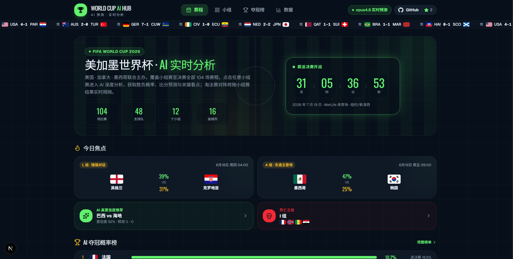
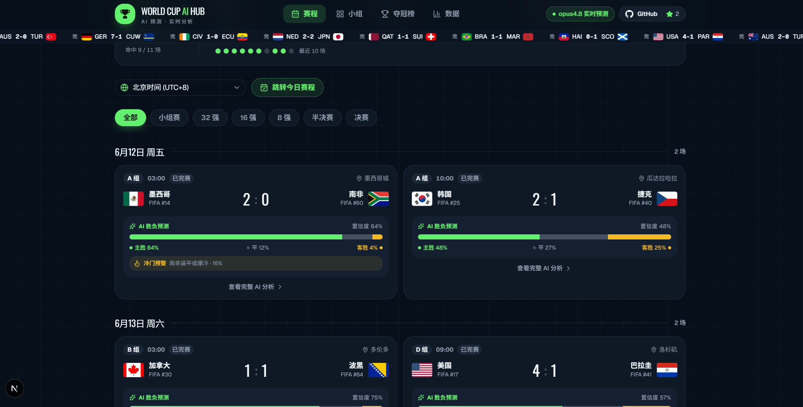
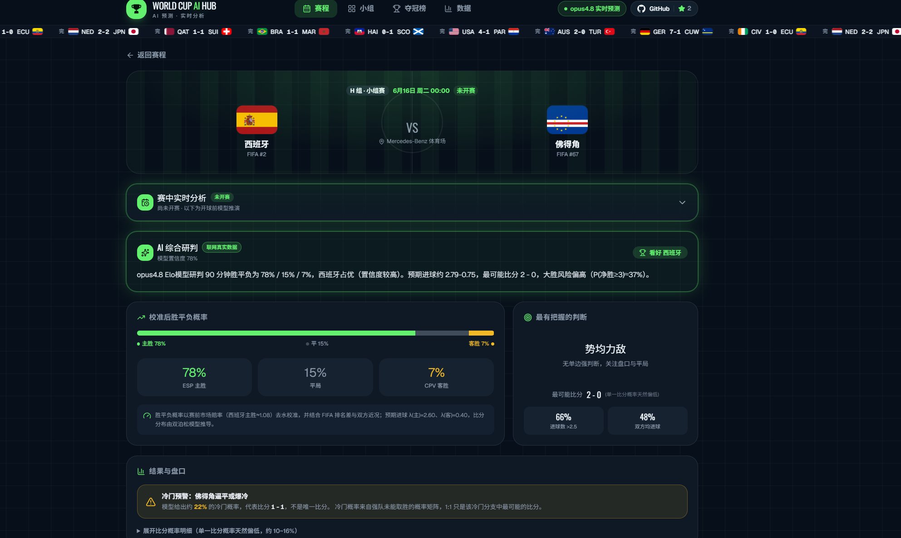
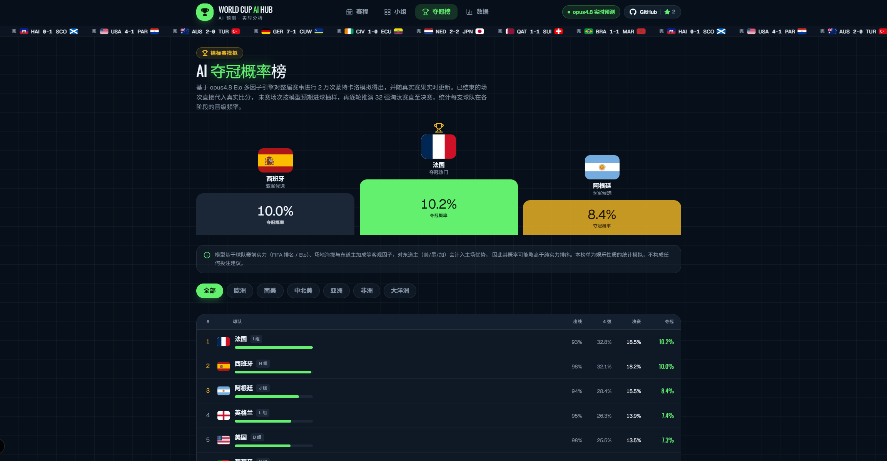
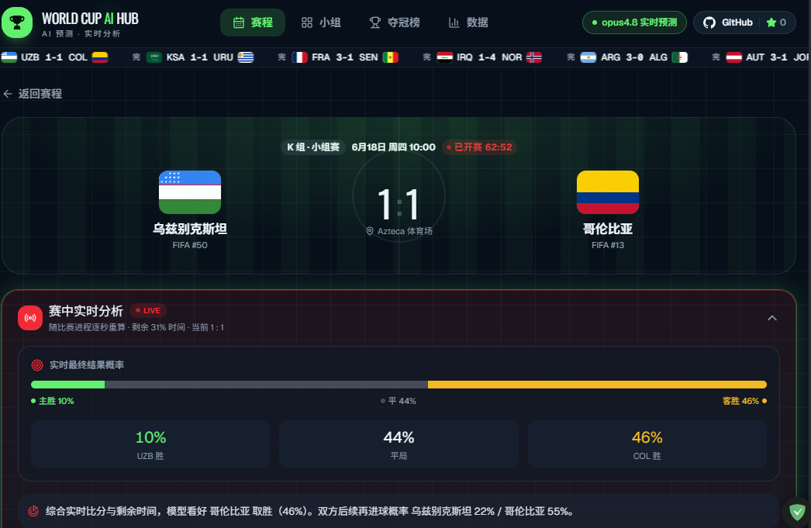
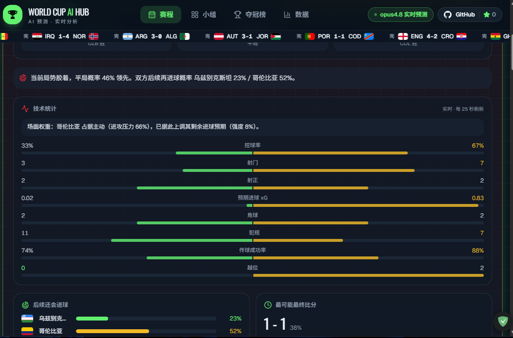
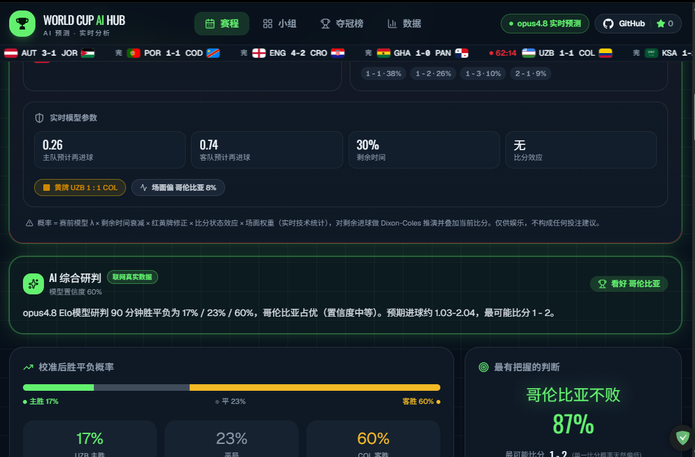
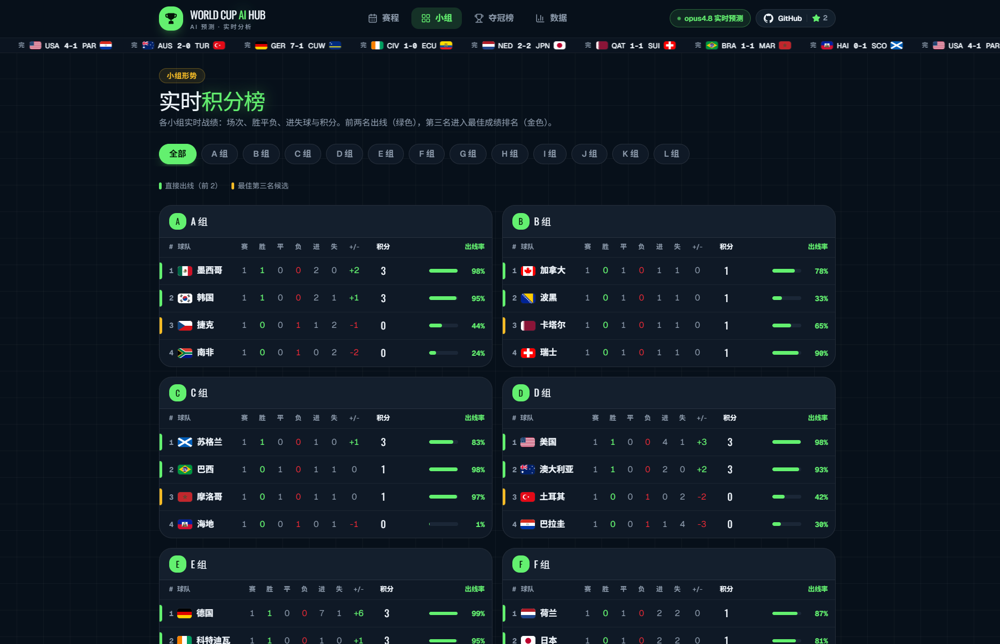

<div align="center">

# WORLD CUP AI HUB

**2026 世界杯 AI 预测与实时分析平台**

覆盖 104 场赛事，提供赛前胜平负概率与比分分布、比赛中实时终场概率推演、蒙特卡洛夺冠模拟、实时比分、静态预渲染页面，以及前台零 AI 实时调用的低成本访问体验。

[](https://wc.netzfs.com)


[在线演示](https://wc.netzfs.com) · [功能特性](#功能特性) · [预测引擎](#预测引擎) · [快速开始](#快速开始) · [部署](#部署) · [免责声明](#免责声明)

</div>

---

> [!NOTE]
> WORLD CUP AI HUB 是统计建模与工程实践项目。所有预测结果仅供娱乐、讨论和技术研究，不构成投注建议，也不应被理解为确定性结论。

## 项目简介

WORLD CUP AI HUB 面向 2026 世界杯，围绕 48 支球队、12 个小组和 104 场比赛，提供赛程、积分形势、逐场预测、冠军概率、实时比分和比赛详情页。

项目的核心设计是 **前台零 AI 实时调用**：胜平负概率、比分分布、夺冠概率等模型结果由离线预测引擎生成并写入静态数据或本地数据库；页面主要读取已生成的数据并渲染。这样可以降低运行成本，提高响应速度，并让同一版本的数据输出可追溯、可复现。

实时比分、事件、阵容、技术统计等动态内容依赖外部足球数据 API 和本地 `poller` 写库任务。当没有配置 API Key 或外部服务不可用时，网站仍可展示静态赛程、基础预测和数据库中已有的最后一次快照。

开源仓库不分发真实运行数据库 `data/wc.db`。仓库内提供人工构造的 `data/sample.wc.db`，仅用于展示 SQLite 表结构和字段格式，不代表真实比赛数据。

## 在线演示

- 生产站点：[https://wc.netzfs.com](https://wc.netzfs.com)
- 本地开发默认地址：[http://localhost:3000](http://localhost:3000)

## 项目截图

以下截图按用户阅读路径排列，便于快速理解项目的核心功能和信息层次。

### 开屏页



### 赛程总览



### 赛前预测



### 夺冠概率



### 比赛中实时分析与实时比分

赛中模块基于实时比分、比赛时间、技术统计和赛前模型参数，对终场结果概率做动态推演。它不调用前台 AI，也不把实时推演包装成确定结论。

1. 实时比分与终场概率：展示当前比分、比赛状态和剩余时间对应的结果推演。



2. 技术统计与场面权重：展示控球、射门、xG、犯规等实时数据如何影响推演。



3. 模型参数与综合研判：展示赛前模型参数、剩余时间和最终研判结论。



### 小组形势



## 功能特性

| 模块 | 路由 | 说明 |
| --- | --- | --- |
| 赛程与预测 | `/` | 104 场比赛列表，支持阶段筛选、日期视图、实时比分叠加和逐场 AI 预测摘要。 |
| 小组形势 | `/groups` | 12 个小组积分榜，结合真实赛果和模拟结果展示排名与出线形势。 |
| FIFA 排名 | `/rankings` | 48 强排名信息总览，用于辅助理解球队基础实力。 |
| AI 夺冠榜 | `/champions` | 基于蒙特卡洛模拟展示夺冠、进决赛、进 4 强、进 8 强、出线等阶段概率。 |
| 比赛详情 | `/match/:id` | 单场胜平负概率、预期进球、比分分布、关键因素、阵容与伤停信息。 |
| 实时比分 API | `/api/live` | 为前端提供实时比分、事件、阵容、技术统计和冠军榜读库结果。 |

## 项目亮点

- **覆盖完整赛程**：面向 2026 世界杯 104 场赛事设计，包含小组赛与淘汰赛席位。
- **静态预渲染优先**：页面以 Next.js App Router 和 React Server Components 为主，降低访问时计算压力。
- **前台零 AI 实时调用**：浏览器端不直接调用大模型，不暴露模型 Key，也不在用户访问时临时生成预测。
- **模型结果可复现**：预测结果来自离线生成的数据产物和本地数据库，便于版本化、审查和回滚。
- **实时数据可降级**：外部 API 不可用或未配置 Key 时，核心静态内容仍可正常访问。
- **工程边界清晰**：赛程数据、模型输出、实时 API 数据、LLM 辅助推断分别处理，避免混淆为官方结论。

## 预测引擎

平台面向用户展示的预测署名为 **opus4.8**，底层为 Elo 多因子预测引擎。它将球队基础实力、主客场与东道主因素、近期状态、缺阵信息等变量转化为进球期望，再生成胜平负概率、比分分布和淘汰赛模拟结果。

当前引擎的主要方法包括：

- 基于 Elo 实力差的基础胜率估计。
- 结合 Dixon-Coles / Poisson 思路生成进球分布。
- 对平局、强弱悬殊、淘汰赛晋级进行额外校准。
- 使用蒙特卡洛模拟生成夺冠、进决赛、进 4 强、进 8 强、小组出线等阶段概率。
- 已结束比赛使用真实比分参与后续模拟，避免继续用赛前预测覆盖已发生结果。

> [!IMPORTANT]
> 历史回测和模型校准只能说明模型在既有数据上的表现，不代表未来比赛一定准确。足球比赛受伤病、红牌、临场战术、天气、赛程密度等因素影响，预测结果应作为概率参考，而不是结论。

模型训练脚本、评估报告、参数版本和数据许可说明建议随模型产物持续维护；首发仓库仅保留已能公开的部分，不纳入未脱敏材料或受限授权内容。

## 技术架构

```text
静态基础数据
  lib/data.ts
    ├─ 球队 / 分组 / 场馆 / 赛程 / 已知赛果
    ├─ 离线预测产物
    │   ├─ wc-predictions.json
    │   └─ champion-sim-data.ts
    └─ 页面数据组装
        └─ Next.js App Router / React Server Components

外部实时数据
  API-Football / football-data.org
    └─ scripts/poller.mjs
        ├─ 写入 data/wc.db
        ├─ 更新比分 / 事件 / 阵容 / 技术统计
        └─ 必要时重算 champion_sim 表

前端访问
  页面静态预渲染
    └─ live-provider 客户端轮询 /api/live
        └─ 将实时比分和数据库快照叠加到静态赛程
```

架构原则：

- 页面优先读取本地静态数据和数据库快照。
- 外部 API 请求集中在服务端脚本和服务端模块中处理。
- API Key 只允许存在于服务端环境变量或本地未提交的密钥文件中。
- 前端拿到的是清洗后的业务数据，不直接接触外部 API Key。

## 技术栈

| 分类 | 技术 |
| --- | --- |
| 框架 | Next.js 16 App Router |
| UI | React 19、React Server Components |
| 语言 | TypeScript 5 |
| 样式 | Tailwind CSS v4 |
| 组件 | shadcn/ui 风格组件、`@base-ui/react`、`lucide-react` |
| 数据库 | SQLite、Drizzle ORM、`better-sqlite3` |
| 数据任务 | Node.js 脚本、`scripts/poller.mjs` |
| 包管理 | pnpm |

## 快速开始

### 环境要求

- Node.js 20+
- pnpm 9+

### 安装与启动

```bash
# 1. 安装依赖
pnpm install

# 2. 配置环境变量（可选；实时数据需要）
cp .env.example .env.local

# 3. 启动开发服务器
pnpm dev
```

启动后访问：

```text
http://localhost:3000
```

如果不配置任何 API Key，应用仍可展示静态赛程、预测数据和已有数据库快照；实时比分不会继续从外部服务刷新。

## 环境变量

| 变量 | 必填 | 用途 |
| --- | --- | --- |
| `API_FOOTBALL_KEY` | 否；运行 `poller` 时通常需要 | API-Football Key，用于拉取实时比分、事件、阵容和技术统计。 |
| `FOOTBALL_DATA_API_KEY` | 否 | football-data.org Key，可用于实时比分或备用数据源。 |
| `POLLER_ENABLED` | 否；启动常驻轮询时需要设为 `1` | 防止误启动写库任务的显式开关。 |
| `WC_SEASON` | 否 | 数据任务使用的赛季，默认按脚本配置处理。 |
| `WC_DB_PATH` | 否 | SQLite 数据库路径，默认使用项目内 `data/wc.db`。 |
| `GLM_API_KEY` | 否 | 可选的赛前因素或文本分析服务 Key。 |
| `MIMO_API_KEY` | 否 | 可选的赛前情报或文本分析服务 Key。 |

密钥可以放在 `.env.local`，也可以参考 `config/secrets/keys.example.mjs` 创建本地密钥文件：

```bash
cp config/secrets/keys.example.mjs config/secrets/keys.local.mjs
```


## 样例数据库

真实运行库默认是 `data/wc.db`，由 `poller` 和数据脚本在本地写入，不随开源仓库分发。

仓库提供一个人工构造的样例库：

```text
data/sample.wc.db
```

它用于展示表结构和最小字段格式，包含少量示例比分、阵容、事件、裁判、技术统计和冠军概率快照。样例数据不来自外部 API，也不代表真实比赛结果。

重新生成并验证样例库：

```bash
pnpm sample:db
pnpm sample:db:verify
```

## 本地实时数据与 poller

`pnpm dev` 只启动网站，不会自动启动实时数据写库任务。若要持续拉取 API-Football 数据，需要另开一个终端运行 `poller`。

macOS / Linux:

```bash
POLLER_ENABLED=1 API_FOOTBALL_KEY=你的_key node scripts/poller.mjs
```

如果 Key 已放在 `config/secrets/keys.local.mjs`：

```bash
POLLER_ENABLED=1 node scripts/poller.mjs
```

Windows PowerShell:

```powershell
$env:POLLER_ENABLED = "1"
node scripts/poller.mjs
```

`poller.mjs` 会常驻运行，按比赛状态拉取并写入 `data/wc.db`。停止 `poller` 后，前端仍可读取数据库中的最后一次写入结果，但不会继续刷新实时数据。

> [!TIP]
> 生产环境建议用 PM2、systemd、容器任务或托管定时任务守护 `poller`。Vercel 等无常驻进程环境通常需要把 `poller` 拆到独立 Worker 或定时任务中运行。

## 部署

### Vercel

适合部署静态预渲染页面和服务端 API。

1. 导入仓库。
2. 配置需要的环境变量。
3. 执行默认 Next.js 构建。
4. 如需持续实时数据，另行部署 `poller` 或定时任务来更新数据库。

### 自有服务器

适合同时运行 Next.js 应用和常驻 `poller`。

```bash
pnpm install
pnpm build
pm2 start node_modules/next/dist/bin/next --name wc -- start -H 127.0.0.1 -p 3000
pm2 save
```

运行实时数据任务：

```bash
POLLER_ENABLED=1 pm2 start scripts/poller.mjs --name wc-poller
pm2 save
```

nginx 可反向代理到本地端口：

```nginx
location / {
  proxy_pass http://127.0.0.1:3000;
  proxy_set_header Host $host;
  proxy_set_header X-Real-IP $remote_addr;
  proxy_set_header X-Forwarded-For $proxy_add_x_forwarded_for;
  proxy_set_header X-Forwarded-Proto $scheme;
}
```

## 目录结构

```text
app/                         Next.js App Router 路由与页面
  api/live/                  实时数据读库 API
  match/[id]/                比赛详情页
components/                  页面组件与 UI 组件
  ui/                        基础 UI 组件
config/secrets/              本地密钥配置模板与本地覆盖文件
data/                        本地数据库目录和样例数据库
docs/                        项目文档
lib/                         数据层、预测引擎、数据库读取与工具函数
  data.ts                    核心静态数据组装
  prediction-v2.ts           Elo 多因子预测引擎
  champion-sim-data.ts       冠军概率静态基线
  db/                        SQLite / Drizzle 读写模块
public/                      静态资源
scripts/                     数据拉取、入库、模拟与维护脚本
  poller.mjs                 实时比分轮询与写库任务
  run-champion-sim.mjs       手动重算冠军模拟
  lib/champion-sim-core.mjs  蒙特卡洛模拟核心
```

## 数据与方法

本项目会明确区分以下几类信息：

| 类型 | 来源或生成方式 | 说明 |
| --- | --- | --- |
| 赛程、球队、分组、场馆 | 官方赛程、公开资料、维护在本地数据文件中 | 用于页面基础展示和比赛索引。 |
| 实时比分、事件、阵容、技术统计 | API-Football、football-data.org 等外部 API | 依赖 API Key、额度和服务可用性；失败时降级到已有快照。 |
| 胜平负、比分分布、夺冠概率 | 本项目预测引擎离线生成 | 属于模型输出，不是官方结果，也不是确定性判断。 |
| 阵容、伤停、战术因素文本 | 公开资料、外部 API、可选 LLM 辅助整理 | 需要标注来源和不确定性，不能伪装成官方确认信息。 |
| 样例数据库 | 人工构造 | 用于展示表结构，不代表真实比赛数据。 |

数据维护原则：

- 真实赛果优先于赛前预测。
- 外部 API 原始结果进入本地数据库前应做字段清洗和容错处理。
- 模型产物应记录生成时间、参数版本和输入数据版本。
- 对无法确认的信息使用保守表述，并补充来源说明；不要把未确认结论写成确定事实。

## 贡献指南

欢迎围绕数据质量、模型评估、前端体验、文档和工程稳定性提交改进。

建议流程：

1. Fork 仓库并创建功能分支。
2. 运行 `pnpm install` 安装依赖。
3. 修改前先确认相关数据来源、脚本和页面边界。
4. 提交前运行必要检查：

```bash
pnpm lint
pnpm build
pnpm sample:db:verify
pnpm audit:keys
```

提交 Pull Request 时请说明：

- 改动目的。
- 涉及的数据来源或模型产物。
- 是否影响数据库结构、样例库、预测结果或部署流程。
- 是否新增环境变量或外部服务依赖。

## 免责声明

WORLD CUP AI HUB 的预测、概率、模拟和分析内容仅供娱乐、讨论与技术研究。足球比赛具有高度不确定性，任何模型都无法保证结果准确。

本项目不提供投注建议，不鼓励任何形式的赌博行为。请理性使用预测结果，并遵守所在地法律法规。

## 开源协议

本项目代码采用 MIT License，详见 [`LICENSE`](./LICENSE)。

外部 API 返回数据、第三方赛事资料、截图、图标和模型输入数据可能受各自来源的许可约束。代码协议不自动授予这些第三方数据的再分发权。

## 致谢

- [Next.js](https://nextjs.org/)
- [React](https://react.dev/)
- [Tailwind CSS](https://tailwindcss.com/)
- [shadcn/ui](https://ui.shadcn.com/)
- [API-Football](https://www.api-football.com/)
- [football-data.org](https://www.football-data.org/)
- FIFA 官方赛程与公开赛事资料
- Wikipedia 等公开资料来源
- 同源算法与训练思路参考：[`worldcup-deep-analysis`](https://github.com/netz888/worldcup-deep-analysis)
